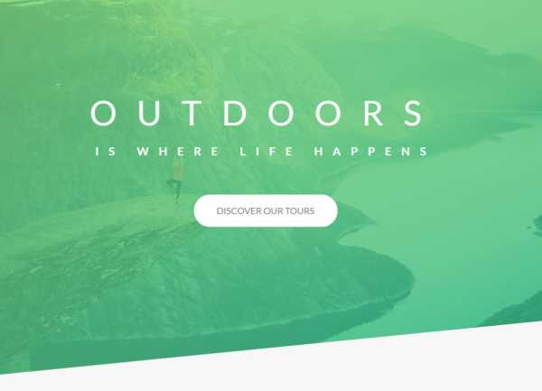
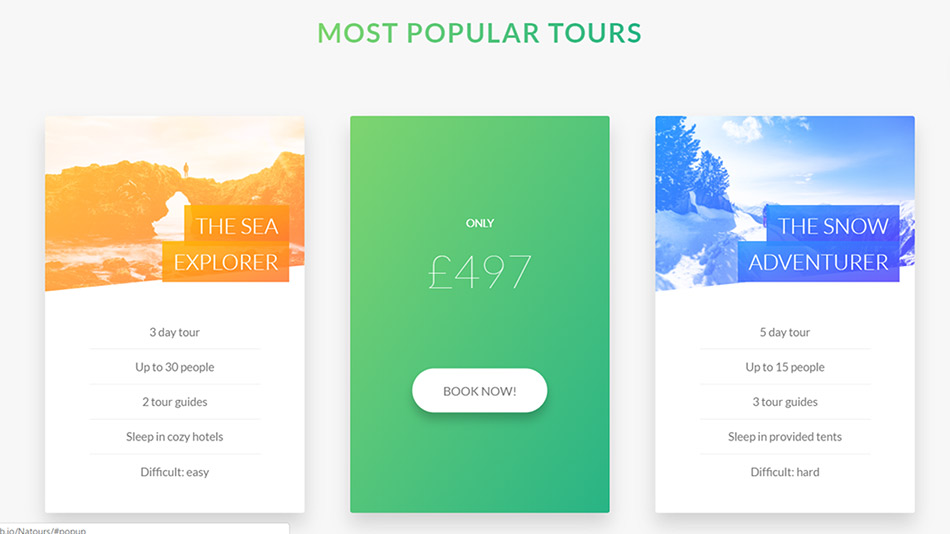
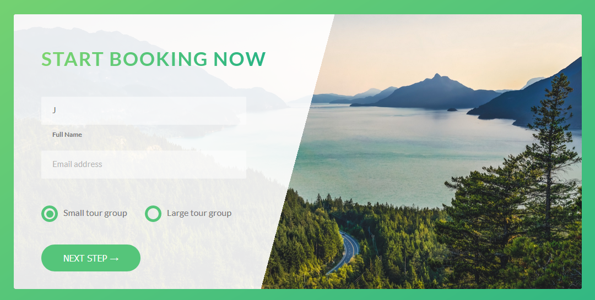
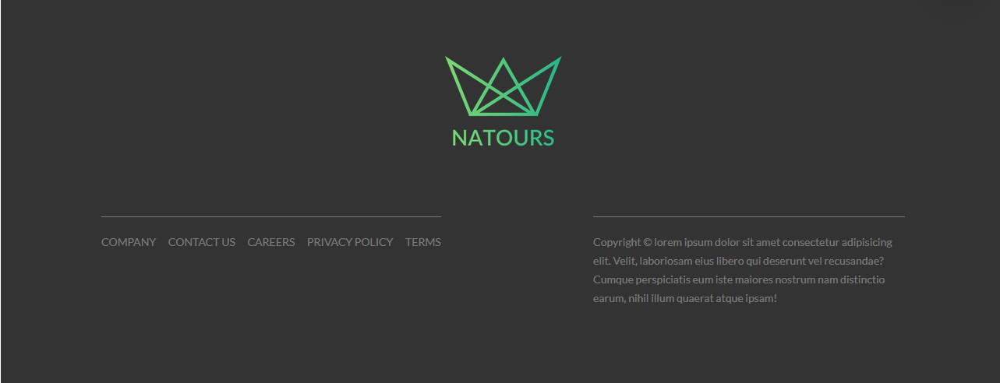
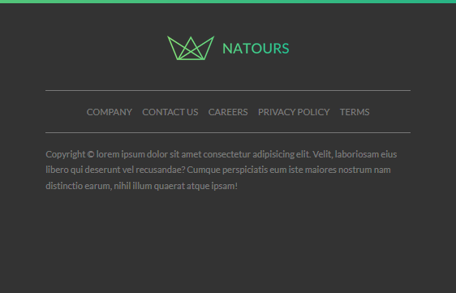

# Natours-description

This is practice project I've developed by following along with Jonas Schmedtmann's <a href="https://www.udemy.com/advanced-css-and-sass/" rel="nofollow"> Advanced CSS and Sass course.</a>

<h2>Technologies</h2>

<ul>
  <li>HTML5</li>
  <li>SCSS(BEM)</li>
  <li>NPM & NPM Scripts</li>
  <li>Responsive Web Design</li>
  <li>7-1 pattern</li>
  <li>Linear gradients</li>
  <li>Video html element</li>
</ul>

<h2>What I've learned?</h2>

During creation of this landing page I learnd about many new CSS properties and techniques, in which I didn't had
prevoius experience, and best ways how to implement them in project.

While creating the header part of the page I've learned how to use "clip-path"property, which gives really nice
design feature where backgrounds are cut off.

Also,this project taught a lot of neat ways to use css in order to create some delightful effects.
These cards, for instance, flip when hovered.

There are many useful details used on booking form on this site.
Custom radio buttons, nice angled overlay, and upon typing in either input, the placeholder text
drifts underneath so that is still labeled in some way.

Very valuable lesson was about how to arhitect my code, for what i used BEM methodology.
I also learned how to implement 7-1 Sass pattern, which is a great way to impose some
structure on your file system.

Important part of this course is about responsive web design, where lessons about responsive images comes in handy,
and not just consedering responsive design, but also as a one of crucial parts for better 
web performance overall.Here I learned different techniques about serving right image for different screen sizes.

On following example I used "art direction" and "density switching" techniques with &lt;picture&gt; and &lt;source&gt; html elements, togheter with "srcset" attribute,
on my footer logo.
This allows me to serve different images for different resolutions and widths of the screen.

Screen size: 1200px

Screen size: 600px

Those are just some of many great features i learned throughout this course.
For live preview, please check out link bellow.

<h2>Live preview</h2>

<a href="https://natours-bay-kappa.vercel.app/">Click here for live preview!</a>
